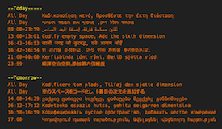

# Google Calendar Widget (Übersicht Google Widgets Suite)

Here it comes, a new year and a new widget. Let's make 2017 a good year!

This widget shows events for today and tomorrow based on your the time zone set in your Google calendar settings. As opposed to the preceding widgets for google calendars, it utilises Google Calendar API and Google Oauth2. This is the first widget as a part of Übersicht Google Suite comprising of other widgets that uses Google API (coming soon).



## Setup:
1. Perhaps obvious but you would need a google account
2. Go to https://console.developers.google.com > click on API Project > select Create project > fill in your project name > click on create
3. Make sure you are in API Manager
4. Select Credentials > select Create credentials > select OAuth client ID > select Other > fill in the name such as ubersicht > copy client ID and client secret > paste them in the calendar.coffee file after CLIENT_ID: and CLIENT_SECRET: They are located on the top. Note that you would need to store them as string i.e. surround them with ```""```. 
The cred file should look like the following:

    ```
    CLIENT_ID: your_client_id
    CLIENT_SECRET: your_client_secret
    AUTHORIZATION_CODE:
    ```

5. Go to OAuth consent screen > fill in/choose your gmail address > fill in Product name shown to users with the same name that you chose in the step 2 above > make sure to save
6. Saving your script should launch a web browser asking whether you would like to allow your app to view google calendar. Click Allow and the next screen will show a code. Please copy and paste it in the cred file besides AUTHORIZATION_CODE:. In case a browser does not launch please click on Refresh All Widgets option found in Ubersichts icon on your mac menu bar.
7. Please put the name(s) of your calendar(s) that you would like to display - seperated with commnas ```,```
- after calendar_name: in calendar.coffee file. Note that you would need to store them as string. Please note calendar names are case sensitive. 
8. Save the calendar and your calendar events should now show if all goes well. If they do not show after 30 sec to 1 min. try clicking on Refresh All Widgets option.

## Notes:
- Make sure to name the project name (where you get your client ID and client secret) the same as the oauth product name. Else it seems to return an error when obtaining authorization code.
- You may add calendars as you like. Please make sure the calendar names do not contain white spaces due to the current limitation. You can for instance use underscore to bind words in the calendar names.

## Time Zone:
Your calendars' timezone (Triangle on the right of your calendar > Calendar settings > Calendar Time Zone > Calendar Time zone) need to match your time zone for your Calendar Settings (Cogwheel on the right in Google Calendar > Settings > Your current time zone) for events to show correctly.
For instance, I have set both time zones as (GMT+00:00). When they are different, All Day events may be show in both Today and Tomorrow even though they are supposed to be only for today. 

Generally if the calendar does not display even though you have filled correct client ID and clinet secret and authorization code, try to refresh ubersicht to re-read your calendar data. A network disruption while calendar data is being read could cause errors.

## Lastly...
The sample events on the screenshot are not supposed to make sense. They were written for testing purposes.
Translation was done using the tool : http://translatr.varunmalhotra.xyz/

## Credits:
parsej.sh is made by the devs at ShellShoccar-jpn. Huge thanks to ShellShoccar-jpn.
https://github.com/ShellShoccar-jpn/Parsrs/blob/master/parsrj.sh

## Disclaimer:
This widget especially the oauth.sh is still at beta stage. Please use at your own risk. I would also highly appreciate constructive feedback. Many thanks.

## To-do
- Add location?
