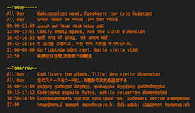

# Google Calendar widget for Übersicht

Shows today's and tomorrow's events for one or more Google Calendars in
[Übersicht](http://tracesof.net/uebersicht/), sorted by real start time and
formatted in your calendar's own timezone.



This is a TypeScript rewrite of the original CoffeeScript widget. It replaces
the old shell-script pipeline (`curl` + hand-rolled JSON parsing + `sed`/`awk`
timezone arithmetic + a dead "out of band" OAuth flow) with a typed Node CLI
that uses Google's official API client, a loopback OAuth flow, and a small
`.jsx` render layer that Übersicht bundles itself. See "How it works" below
if you're curious about the architecture; otherwise skip to Setup.

## Setup

### 1. Get a Google OAuth client ID/secret

1. Go to https://console.developers.google.com, create (or pick) a project.
2. Under **APIs & Services > Library**, enable the **Google Calendar API**.
3. Under **APIs & Services > OAuth consent screen**, fill in the required
   fields (you can leave it in "Testing" mode; add your own Google account
   as a test user).
4. Under **APIs & Services > Credentials**, create an **OAuth client ID**
   of type **Desktop app** (or "Web application" with
   `http://127.0.0.1` as an authorized redirect URI — the setup flow below
   uses a loopback redirect on a random local port).
5. Copy the generated **Client ID** and **Client secret** — you'll paste
   them in during step 3 below.

### 2. Install dependencies

```sh
pnpm install
```

`pnpm install` also runs `pnpm run build` automatically (via `postinstall`),
producing the compiled widget files described in "How it works" below.

### 3. Authorize (one-time)

```sh
pnpm run auth
```

This is an interactive command you run once from a terminal — it is never
invoked by Übersicht itself. On first run it prompts for:

- your Google OAuth **client ID** and **client secret** (from step 1)
- the **names of the Google Calendars** you want to display, exactly as
  they appear in Google Calendar (case-sensitive; comma-separated if more
  than one)
- whether to display times in **12-hour** or **24-hour** format
- optionally, a **timezone override** (IANA name, e.g. `America/Chicago`)
  if you want the widget to use a timezone other than your calendar's own

It then opens a browser to Google's consent screen. Click **Allow**, and
the flow completes automatically — no authorization code to copy/paste.
Config and token are written to `~/.config/ubersicht-google-calendar/`
(`config.json`, `token.json`), with `token.json` permissioned `0600`.

You can re-run `pnpm run auth` at any time to change calendars, formatting,
or re-authorize from scratch.

### 4. Build and install the widget

```sh
pnpm run build
```

Then copy (or symlink) the `calendar.widget/` folder into Übersicht's
widgets directory:

```sh
cp -R calendar.widget "$HOME/Library/Application Support/Übersicht/widgets/"
```

Open Übersicht's menu bar icon and choose **Refresh All Widgets** (or
restart Übersicht) if the calendar doesn't appear within a minute.

### 5. (Optional) Build a distributable zip

```sh
pnpm run package
```

Builds, runs the test suite, and produces `ubersicht-google-calendar.widget.zip`
containing just the compiled widget (`index.jsx`, `lib/`, `package.json`) —
useful for sharing a ready-to-install artifact without the source tree.

## Timezone behavior

Events are bucketed into "today" and "tomorrow" using your calendar's own
timezone (Google Calendar > Settings > **Calendar Time Zone**), or the
`timezoneOverride` you set during `pnpm run auth` if you'd rather pin it
explicitly. Day boundaries are computed with real timezone-aware date math
(via `luxon`), so this is correct across DST transitions and non-hour
UTC offsets (e.g. India's +5:30, Nepal's +5:45) — the old shell script's
`sed`-based offset arithmetic could get this wrong.

## Troubleshooting

The widget prints structured errors instead of failing silently:

- **"Config file not found..."** — run `pnpm run auth`.
- **"Token file not found..."** — run `pnpm run auth`.
- **"Calendar(s) not found..."** — the name(s) in your config don't
  exactly match a calendar in your Google account (case-sensitive); the
  error lists the calendars actually available so you can fix a typo.
- Any other error is shown directly in the widget with a `⚠` prefix.

## How it works

This is a two-part build, mirroring the split between the old shell scripts
and the CoffeeScript render layer, except both halves are now TypeScript:

- **`src/cli/*.ts`** — a real Node CLI (`fetch-events.ts`) that loads
  config, refreshes the OAuth token if needed, calls the Calendar API via
  `googleapis`, sorts/formats events, and prints one JSON line to stdout.
  Bundled by esbuild into `calendar.widget/lib/fetch-events.js`.
- **`src/widget/index.tsx`** — the actual Übersicht widget entry
  (`command`/`render`/`updateState`/`className`). It shells out to
  `lib/fetch-events.js`, parses its JSON output, and renders the result.
  Bundled by esbuild (JSX left untouched — Übersicht's own babel pass
  transforms it at widget-load time) into `calendar.widget/index.jsx`.
- **`src/setup/authorize.ts`** — the one-time interactive OAuth loopback
  flow behind `pnpm run auth`. Bundled into `calendar.widget/lib/authorize.js`.

Compiled output under `calendar.widget/lib/` and `calendar.widget/index.jsx`
is build output, not committed to the repo (`.gitignore`d) — run
`pnpm install && pnpm run build` to produce it.

## Testing

```sh
pnpm run test        # vitest — sort/format logic, timezone day-boundary math, config validation
pnpm run typecheck    # tsc --noEmit
```

## Legacy files

This repo still contains the original CoffeeScript widget and its shell
scripts (`calendar.widget/calendar.coffee`, `calendar.widget/assets/*.sh`,
`clean.sh`, `gitPushOriginMaster.sh`, `calendar.widget.zip`, etc.) — they
are no longer used by the TypeScript rewrite above and are slated for
removal in a follow-up cleanup pass.

## License

MIT — see [LICENSE](LICENSE).
